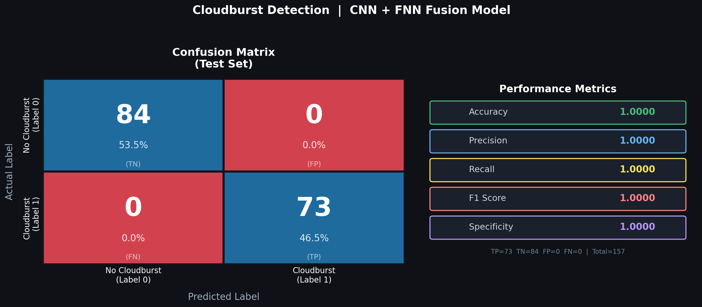
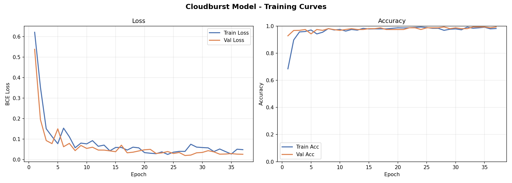

# RealCloud Burst Detection — CNN + FNN Fusion Model

A multimodal deep learning system that detects **cloudburst events** by fusing satellite cloud images (CNN) with ERA5 meteorological tabular data (FNN).

---

## Results

| Metric | Score |
|---|---|
| Test Accuracy | **100.00%** |
| Precision | **100.00%** |
| Recall | **100.00%** |
| F1 Score | **100.00%** |




---

## Model Architecture

```
Satellite Image ──► CNN Branch  (Conv×4 → GAP → Dense 256) ──┐
                                                               ├──► Fused (320) ──► Dense ──► Sigmoid
ERA5 Features   ──► FNN Branch  (Dense 64 → 128 → 64)    ────┘
```

- **CNN**: 4 convolutional blocks with BatchNorm, MaxPool, Dropout → GlobalAvgPool → Dense(256)
- **FNN**: 3 dense layers with BatchNorm and Dropout → 64-dim vector
- **Fusion**: Concatenation of CNN(256) + FNN(64) → Dense(128) → Dense(64) → Binary output

---

## Dataset

| Source | Cloudburst | No Cloudburst | Total |
|---|---|---|---|
| **Images** (`dataset/cloudburst/`, `dataset/non_cloudburst/`) | 492 | 579 | 1071 |
| **Tabular** (`ERA5_Single_Sheet main.xlsx`) | 500 rows | 550 rows | 1050 rows |
| **Paired & used** | 492 | 550 | **1042** |

**Alignment strategy**: Class-level index pairing — image `i` of class C ↔ tabular row `i` of class C. Truncate to min count per class.

**ERA5 features**: `Latitude`, `Longitude`, `Temperature (K)`, `Precipitation`

**Split**: 70% train / 15% val / 15% test → **729 / 156 / 157**

> ⚠️ The `dataset/` folder (images) is excluded from this repo due to size (~350 MB). Add your own images following the structure below.

---

## Project Structure

```
final cloud/
├── dataset/                    # ← Add your images here (not tracked by git)
│   ├── cloudburst/             #   492 cloudburst PNG images
│   └── non_cloudburst/         #   579 non-cloudburst PNG images
├── ERA5_Single_Sheet main.xlsx # ERA5 tabular data (500 CB + 550 non-CB rows)
│
├── dataset_loader.py           # Data alignment + PyTorch Dataset + DataLoaders
├── model.py                    # CNN Branch + FNN Branch + Fusion model
├── train.py                    # Training loop with early stopping
├── confusion_matrix.py         # Confusion matrix generator
├── predict.py                  # Single-sample inference CLI
├── data_audit.py               # Pre-training data verification
│
├── cloudburst_model.pth        # Trained model weights (best checkpoint)
├── training_log.csv            # Epoch-by-epoch metrics
├── training_curves.png         # Loss & accuracy plots
├── confusion_matrix.png        # Confusion matrix visualization
└── requirements.txt
```

---

## Setup & Usage

### 1. Install dependencies

```bash
pip install torch torchvision --extra-index-url https://download.pytorch.org/whl/cpu
pip install pandas openpyxl scikit-learn matplotlib pillow
```

### 2. Verify your data alignment

```bash
python data_audit.py
```

### 3. Train the model

```bash
python train.py
```

Outputs: `cloudburst_model.pth`, `training_curves.png`, `training_log.csv`

### 4. Generate confusion matrix

```bash
python confusion_matrix.py
```

### 5. Predict on a new sample

```bash
python predict.py --image path/to/image.png --lat 29.0 --lon 84.0 --temp 287.5 --precip 0.006
```

---

## Training Configuration

| Parameter | Value |
|---|---|
| Image size | 224 × 224 |
| Batch size | 32 |
| Optimizer | Adam (lr=0.001, wd=1e-4) |
| LR Scheduler | ReduceLROnPlateau (patience=5, factor=0.5) |
| Loss | BCEWithLogitsLoss |
| Max epochs | 50 |
| Early stopping | Patience = 10 |
| Augmentation | HorizontalFlip, Rotation±15°, ColorJitter |

---

## Technology Stack

- **PyTorch 2.11** (CPU)
- **Python 3.14**
- pandas, openpyxl, scikit-learn, matplotlib, Pillow

---

## Authors

Shaheen Zubair — Department of CSE, Sreepathy Institute of Management and Technology, Palakkad, Kerala, India
